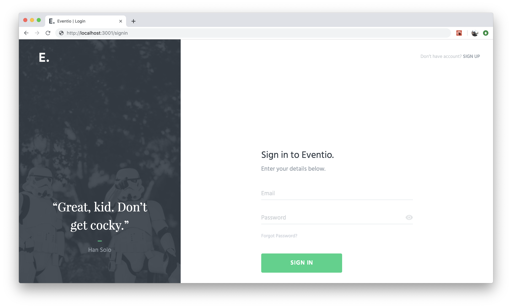

<h1 align="center">
	
	<br>
	<br>
</h1>

<br>
<br>

<p align="center">
	A web app that allows registered users to sign up for and create events.
<br>
<br>

<a href="LICENSE.md">
    
</a>

</p>
<br>

## Getting Started

Clone the repository.

```sh
git clone git@github.com:ythecombinator/eventio.git
```

`cd` into the directory.

```sh
cd eventio
```

Install the project dependencies:

```sh
yarn

# or

npm install
```

Create a `.env` file like the following:

```sh
APP_NAME="Eventio"
API_URL="https://testproject-api-v2.strv.com"
API_KEY="<YOUR API KEY>"
```

Start the development server:

```sh
yarn dev

# or

npm run dev
```

🚀 Head over to [localhost:3001](http://localhost:3001) in your browser of choice.

## Toolbelt

- [x] [Typescript](https://www.typescriptlang.org) for compile-time safety and code scalability with _Interface oriented development_
- [x] [Next.js](https://nextjs.org/) for _Server Side Rendering_, _prefetching_, _dynamic imports_ and other features out-of-the-box
- [x] [Redux](http://redux.js.org/) to manage application state
- [x] [redux-saga](https://redux-saga.js.org) as a middleware to make application side effects easier to manage
- [x] [redux-act](https://github.com/pauldijou/redux-act) to reduce action creators boilerplate and to have a more expressive syntax for reducers
- [x] [immer](https://github.com/mweststrate/immer) as a simpler alternative for immutable state
- [x] Built with [Webpack](https://github.com/webpack/webpack)
- [x] [Hot Module Replacement (HMR)](https://webpack.js.org/concepts/hot-module-replacement) for components, reducers and sagas
- [x] Transpiled with [Babel](https://babeljs.io/)
- [x] [styled-components](https://www.styled-components.com/) as a CSS-in-JS strategy
- [x] [Heroku](https://heroku.com) to deploy production environment
- [x] [Workbox](https://github.com/GoogleChrome/workbox) to generate service-worker and runtime caching

### Roadmap

- [x] Login and Authorized State
- [x] Event List
- [ ] Create Event
- [x] 404 Page
- [ ] Sign Up
- [ ] Reset Password
- [ ] Event details
- [ ] My Profile

### A few notes on technical decisions

I tried to balance the following three aspects the most I could when it
comes to picking to picking the project stack:

- The tech stack [already running at STRV](https://www.strv.com/careers/frontend-developer-react)
- The tech stack I am already used to
- The tech that makes sense for the project

Special attention goes to the state management choice: a simpler alternative (e.g. React Hooks + Context API) could have been used instead of redux but two aspects guided me:

- Altough there are uncountable alternatives for redux as 2019, it's still a solid alternative for state managament
- I was told in the project specification to _treat this app as an MVP of a much larger project that could scale and grow one day_ – and redux does scale well

## License

[eventio](https://github.com/ythecombinator/eventio) is distributed under
the MIT License, [available in this repository](LICENSE.MD).

All contributions are assumed to be also licensed under the same.
